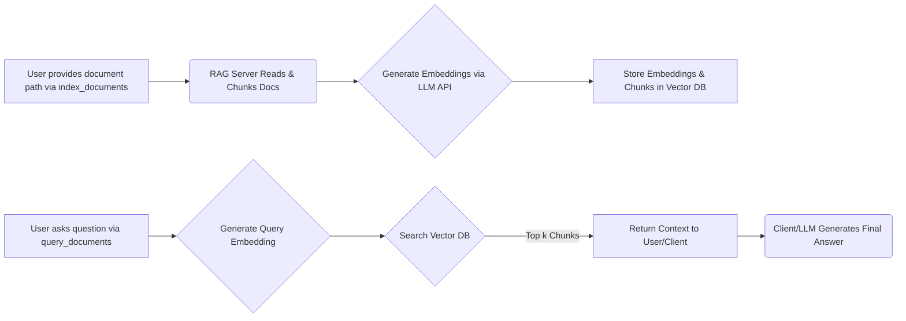

# mcp-rag-server - RAG MCP Server

[](https://www.npmjs.com/package/mcp-rag-server)
[](LICENSE)

mcp-rag-server is a Model Context Protocol (MCP) server that enables Retrieval Augmented Generation (RAG) capabilities. It empowers Large Language Models (LLMs) to answer questions based on your document content by indexing and retrieving relevant information efficiently.

---

## Table of Contents

- [Overview](#overview)
- [MCP Server Usage](#mcp-server-usage)
  - [Basic Configuration](#basic-configuration)
  - [Advanced Configuration](#advanced-configuration)
- [Installation](#installation)
  - [From Source](#from-source)
- [Available RAG Tools](#available-rag-tools)
- [How RAG Works](#how-rag-works)
- [Environment Variables](#environment-variables)
  - [Default Environment Settings](#default-environment-settings)
  - [Configuration Examples for Embedding Providers](#configuration-examples-for-embedding-providers)
- [Integrating with Your Client and AI Agent](#integrating-with-your-client-and-ai-agent)
  - [Example Chat Conversation](#example-chat-conversation)
- [Development](#development)
- [Contributing](#contributing)
- [License](#license)

---

## Overview

mcp-rag-server allows you to seamlessly integrate RAG functionalities into your applications. It works by:

- **Indexing:** Parsing documents and splitting them into manageable chunks.
- **Embedding:** Generating vector embeddings for each text chunk.
- **Querying:** Matching query embeddings with stored document chunks to retrieve context.

This enables downstream LLMs (via MCP clients like Claude Desktop) to generate contextually relevant responses.

---

## MCP Server Usage

### Basic Configuration

Integrate the server with your MCP client by adding the following to your configuration:

```json
{
  "mcpServers": {
    "rag": {
      "command": "npx",
      "args": ["-y", "mcp-rag-server"]
    }
  }
}
```

> **Note:** Ensure that the required environment variables are set in the environment where your MCP client runs the command.

### Advanced Configuration

For custom settings, including environment variables:

```json
{
  "mcpServers": {
    "rag": {
      "command": "npx",
      "args": ["-y", "mcp-rag-server"],
      "env": {
        "BASE_LLM_API": "http://localhost:11434/v1",
        "LLM_API_KEY": "",
        "EMBEDDING_MODEL": "granite-embedding-278m-multilingual-Q6_K-1743674737397:latest",
        "VECTOR_STORE_PATH": "/user-dir/vector_store_locate/",
        "CHUNK_SIZE": "500"
      }
    }
  }
}
```

> **Note:** Environment variable configuration via the client depends on its capabilities. System-level environment variables are generally recommended.

---

## Installation

### From Source

1. **Clone the Repository:**

   ```bash
   git clone https://github.com/yourusername/mcp-rag-server.git
   cd mcp-rag-server
   ```

2. **Install Dependencies:**

   ```bash
   npm install
   ```

3. **Build the Project:**

   ```bash
   npm run build
   ```

4. **Run the Server:**

   Ensure your environment variables are set, then start the server:

   ```bash
   npm start
   ```


### Running with Docker Compose (Recommended)

This is the recommended way to run the server along with its dependencies (ChromaDB and Ollama) in isolated containers.

1.  **Prerequisites:**
    *   Install [Docker Desktop](https://www.docker.com/products/docker-desktop/) (or Docker Engine on Linux).

2.  **Clone the Repository (if not already done):**

    ```bash
    git clone https://github.com/yourusername/mcp-rag-server.git # Replace with actual repo URL
    cd mcp-rag-server
    ```

3.  **Start the Services:**

    From the project root directory, run:

    ```bash
    docker-compose up -d
    ```

    *   This command will build the `rag-server` image (if not already built), download the official ChromaDB and Ollama images, and start all three services in the background (`-d`).
    *   The first time you run this, it might take a while to download the images.
    *   The server will automatically start indexing the project directory on startup (this behavior can be configured via environment variables in `docker-compose.yml`).

4.  **Check Logs (Optional):**

    ```bash
    docker-compose logs -f rag-server
    ```

5.  **Stopping the Services:**

    ```bash
    docker-compose down
    ```

    This will stop and remove the containers, but the data stored in volumes (ChromaDB data, Ollama models) will persist.

---

---

## Available RAG Tools

The server provides the following operations accessible via MCP:

- **index_documents:**  
  Index documents from a directory or a single file.  
  _Supported file types:_ `.txt`, `.md`, `.json`, `.jsonl`, `.csv`

- **query_documents:**  
  Retrieve context by querying the indexed documents using RAG.

- **remove_document:**  
  Delete a specific document from the index by its path.

- **remove_all_documents:**  
  Clear the entire document index (_confirmation required_).

- **list_documents:**  
  Display all indexed document paths.

---

## How RAG Works

The RAG process in the server consists of the following steps:

1. **Indexing:**  
   The `index_documents` tool accepts a file or directory path to begin processing.

2. **Chunking & Embedding:**  
   The server splits documents into chunks (configurable via `CHUNK_SIZE`) and generates vector embeddings using the specified `EMBEDDING_MODEL` via the `BASE_LLM_API`.

3. **Storing:**  
   The embeddings and chunks are stored in a local vector database at the path specified by `VECTOR_STORE_PATH`.

4. **Querying:**  
   When `query_documents` is called, the server generates an embedding for your query.

5. **Searching:**  
   It retrieves the top `k` document chunks that match the query.

6. **Contextualization:**  
   The retrieved chunks are returned as context to your LLM, which then generates a final answer.



---

## Environment Variables

The server relies on several environment variables. These can be set at the system level or passed via your MCP client configuration.

### Default Environment Settings

If not explicitly set, the following defaults from the code will be used:

- **`BASE_LLM_API`** (Required)  
  The base URL for the embedding API endpoint.  
  **Default:** `http://localhost:11434/v1`

- **`LLM_API_KEY`** (Optional)  
  API key for the embedding service (if required).  
  **Default:** `""` (empty string)

- **`EMBEDDING_MODEL`** (Required)  
  The embedding model to use with the API.  
  **Default:** `granite-embedding-278m-multilingual-Q6_K-1743674737397:latest`

- **`VECTOR_STORE_PATH`** (Optional)  
  The directory path for storing the vector database.  
  **Default:** `./vector_store`

- **`CHUNK_SIZE`** (Optional)  
  The target size (in characters) for splitting documents into chunks.  
  **Default:** `500`

### Configuration Examples for Embedding Providers

#### 1. Ollama (Local)

- **Setup:**
  - Ensure Ollama is running and the desired model is pulled (e.g., `ollama pull nomic-embed-text`).
- **Variables:**
  ```bash
  BASE_LLM_API=http://localhost:11434/v1
  LLM_API_KEY=
  EMBEDDING_MODEL=nomic-embed-text
  ```

#### 2. LM Studio (Local)

- **Setup:**
  - Start the LM Studio server and load an embedding model.
- **Variables:**
  ```bash
  BASE_LLM_API=http://localhost:1234/v1
  LLM_API_KEY=
  EMBEDDING_MODEL=lm-studio-model
  ```

#### 3. OpenAI API

- **Setup:**
  - Use your OpenAI credentials.
- **Variables:**
  ```bash
  BASE_LLM_API=https://api.openai.com/v1
  LLM_API_KEY=YOUR_OPENAI_API_KEY
  EMBEDDING_MODEL=text-embedding-ada-002
  ```

#### 4. OpenRouter

- **Setup:**
  - Use your OpenRouter API key.
- **Variables:**
  ```bash
  BASE_LLM_API=https://openrouter.ai/api/v1
  LLM_API_KEY=YOUR_OPENROUTER_API_KEY
  EMBEDDING_MODEL=openai/text-embedding-ada-002
  ```

#### 5. Google Gemini (via OpenAI Compatibility Endpoint)

- **Setup:**
  - Follow Google’s instructions to enable the compatibility endpoint.
- **Variables:**
  ```bash
  BASE_LLM_API=https://generativelanguage.googleapis.com/v1beta
  LLM_API_KEY=YOUR_GEMINI_API_KEY
  EMBEDDING_MODEL=embedding-001
  ```

> **Important:** Always refer to your provider’s documentation for precise API endpoints, model names, and authentication requirements.

---

## Integrating with Your Client and AI Agent

After setting up the MCP server, integrate it with your client (or AI agent) so that it can leverage RAG operations seamlessly.

### Configuring Your MCP Client

Ensure your client configuration includes the RAG server as shown below:

```json
{
  "mcpServers": {
    "rag": {
      "command": "npx",
      "args": ["-y", "mcp-rag-server"],
      "env": {
        "BASE_LLM_API": "http://localhost:11434/v1",
        "LLM_API_KEY": "",
        "EMBEDDING_MODEL": "granite-embedding-278m-multilingual-Q6_K-1743674737397:latest",
        "VECTOR_STORE_PATH": "./vector_store",
        "CHUNK_SIZE": "500"
      }
    }
  }
}
```

### Example Chat Conversation

Below is an example conversation that demonstrates how an AI agent might instruct the MCP server to index documents and query the indexed documents:

**User:**  
Hey, can you add my documents for indexing? I have them stored in `/data/docs`.

**AI Agent:**  
Sure, let me index the documents from `/data/docs` now.

_([Tool Call]: The agent issues an "index_documents" command with the path `/data/docs`.)_

**AI Agent (after processing):**  
The documents have been successfully indexed.

---

**User:**  
Great! Now, could you help me find out what the main topics are in our latest report?

**AI Agent:**  
Okay, I'll query the indexed documents to retrieve context related to your report.

_([Tool Call]: The agent issues a "query_documents" command with the query "What are the main topics in our latest report?")_

**AI Agent (after processing):**  
I found some relevant context from your documents. Based on the retrieved information, the main topics include market trends, customer feedback, and upcoming product features.

---

## Development

### Prerequisites

- Node.js (see `package.json` for version requirements)
- npm

### Building

```bash
npm run build
```

### Testing

_To be implemented:_

```bash
# npm test
```

---

## Contributing

Contributions are welcome! If you wish to propose changes or add features, please:

- Open an issue for discussion before submitting a pull request.
- Follow the code style and commit guidelines provided in the repository.

---

## License

This project is licensed under the [MIT License](LICENSE).
